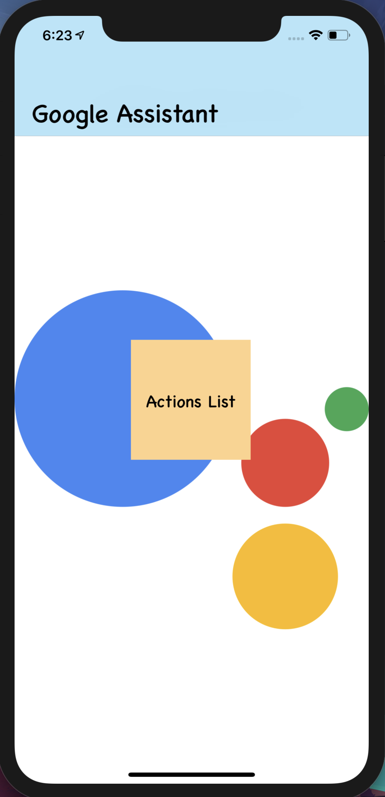
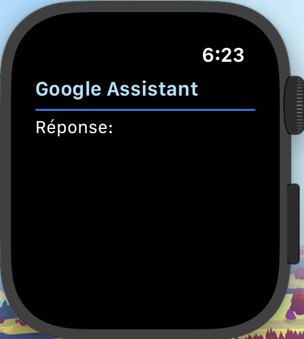
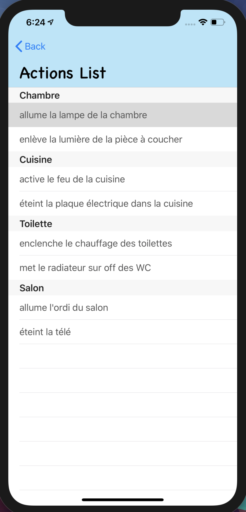
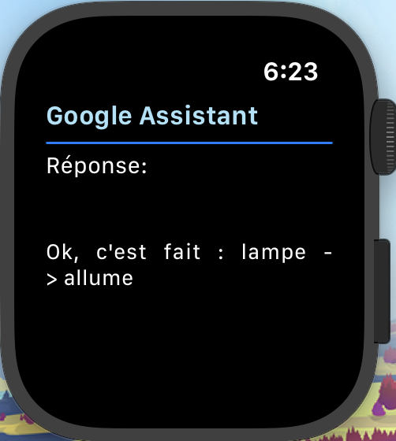

# GoogleAppIOS

## iOS Project 2019-20

---

**Objectif :** __Associer une application d'Iphone et une AppleWatch avec l'Assistant Google__

```
Lancer : Iphone + AppleWatch pour compiler le projet
```

Images du projet:








